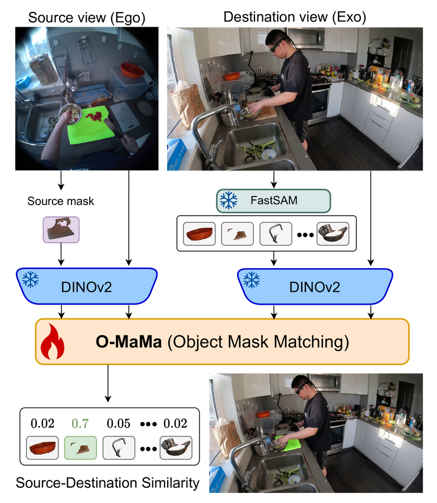

# O-MaMa: Learning Object Mask Matching between Egocentric and Exocentric Views (ICCV 2025)

## ✨✨ Accepted in ICCV 2025!! ✨✨
## 🏆 1st Place Winner in the Ego-Exo4D Correspondence Challenge at the Second Joint Egocentric Vision (EgoVis) Workshop @ CVPR 2025!! 🏆


## 🚀 About
This repository contains the official implementation of the paper *O-MaMa: Learning Object Mask Matching between Egocentric and Exocentric Views* by [Lorenzo Mur-Labadia](https://sites.google.com/unizar.es/lorenzo-mur-labadia/inicio), [Maria Santos-Villafranca](https://maria-sanvil.github.io/), [Jesus Bermudez-Cameo](https://jesusbermudezcameo.github.io/), [Alejandro Perez-Yus](https://i3a.unizar.es/es/investigadores/alejandro-perez-yus), [Ruben Martinez-Cantin](https://webdiis.unizar.es/~rmcantin/), [Jose J. Guerrero](http://webdiis.unizar.es/~jguerrer/).


- 🌐 [Official Webpage](https://maria-sanvil.github.io/O-MaMa/)
- 📝 [Technical Report](https://arxiv.org/pdf/2506.06026v1)
- 📃 [Paper](https://arxiv.org/pdf/2506.06026) – Read the paper!
- 🎥 [Video Presentation](https://www.youtube.com/watch?v=JRwx3oCerm4)


<p align="center">
  
</p>


Understanding the world from multiple perspectives is essential for intelligent systems operating together, where segmenting common objects across different views remains an open problem. We introduce a new approach that re-defines cross-image segmentation by treating it as a mask matching task. Our method consists of: (1) A Mask-Context Encoder that pools dense DINOv2 semantic features to obtain discriminative object-level representations from FastSAM mask candidates, (2) a Ego↔Exo Cross-Attention that fuses multi-perspective observations, (3) a Mask Matching contrastive loss that aligns cross-view features in a shared latent space and, (4) a Hard Negative Adjacent Mining strategy to encourage the model to better differentiate between nearby objects. O-MaMa achieves the state of the art in the Ego-Exo4D Correspondences benchmark.


## 📁 Dataset

Download Ego-Exo4D following the instructions from their [official repository](https://github.com/facebookresearch/Ego4d/blob/main/ego4d/egoexo/download/README.md). Select the correspondence benchmark and the official v2 split.

After downloading the raw data, follow the data preparation steps provided in the [official baselines repository](https://github.com/EGO4D/ego-exo4d-relation/tree/main/correspondence/SegSwap).  
Save the processed data from `process_data.py` in the `processed/` folder inside the datataset directory. Place the JSON output from `create_pairs.py` into the `dataset_jsons/` folder.


Extract masks using the Segment Anything model of your preference. If using FASTSAM use their [official repository](https://github.com/CASIA-IVA-Lab/FastSAM).


Make sure your dataset folder is organized as follows:

<pre>
Ego-Exo4d/
├── processed/
│   ├── [processed videos]
│   ├── ...
│   └── <a href="https://github.com/EGO4D/ego-exo4d-relation/blob/main/correspondence/SegSwap/data/split.json">split.json</a>
├── takes.json
├── dataset_jsons/
│ ├── test_egoexo_pairs.json
│ └── ...
├── Masks_TRAIN_EXO2EGO/
├── Masks_TRAIN_EGO2EXO/
├── Masks_TEST_EXO2EGO/
├── Masks_TEST_EGO2EXO/
├── Masks_VAL_EXO2EGO/
└── Masks_VAL_EGO2EXO/
</pre>


- `processed/`: Contains all the preprocessed videos.
- `split.json`: Required for training/validation/test splits. [Grab it here](https://github.com/EGO4D/ego-exo4d-relation/blob/main/correspondence/SegSwap/data/split.json).
- `takes.json`: Metadata of the dataset.
- `dataset_jsons/`: Should include the JSON files generated by `create_pairs.py`.
- `Masks_TRAIN_EXO2EGO/, ...`: Folders of the masks of the EgoExo and ExoEgo pairs. These folders should be ordered with the same format as the `processed/` folder:

<pre>
Masks_TRAIN_EXO2EGO/
├── [take_ids]
│    └── [cam]
│          ├── [idx]_boxes.npy
│          └── [idx]_masks.npz
└── ...
</pre>

<details>
<summary>Example masks files paths</summary>

```plaintext
Masks_TRAIN_EXO2EGO/c8b9dc5b-8467-40d2-ab27-27923abcb054/aria01_214-1/6240_boxes.npy  
Masks_TRAIN_EXO2EGO/c8b9dc5b-8467-40d2-ab27-27923abcb054/aria01_214-1/6240_masks.npz
```

</details>

**Important!!** Ensure this structure is in place before running the training pipeline.


## Pre-trained models

We provide a checkpoint for the Exo➝Ego correspondence:
You can train the model or perform inference from it:
- [Exo➝Ego weights](https://drive.google.com/file/d/1EwFs5TXwGaJR7nkt_ldmotHAP9UqvLAU/view?usp=sharing)


## Installation

Clone the repository and then create and activate a `omama` conda environment using the provided environment definition:

```shell
conda env create -n omama python=3.12.4
conda activate omama
pip install -r requirements.txt
```

## Evaluation

Run the following line for the Exo➝Ego evaluation:

```shell
python main_eval.py --reverse --root <PATH/TO/DATASET/FOLDER> --devices 0 --checkpoint_dir <PATH/TO/CHECKPOINT> --exp_name Eval_OMAMA
```

To run evaluation in the Ego➝Exo direction, simply omit the `--reverse` flag.


## Training

Please run:

```shell
python main.py --reverse --root <PATH/TO/DATASET/FOLDER> --devices 0 --exp_name Train_OMAMA
```

**Important!!** When the flag --reverse is True, the Exo➝Ego direction is considered.


## Contact
If you have further questions, please contact me [personal email](m.santos@unizar.es)

## Cite
Please, if you are interested, cite our work as follows:
```
@inproceedings{mursantos2025mama,
  title={O-MaMa: Learning Object Mask Matching between Egocentric and Exocentric Views},
  author={Mur-Labadia, Lorenzo and Santos-Villafranca, Maria and Bermudez-Cameo, Jesus and Perez-Yus, Alejandro and Martinez-Cantin, Ruben and Guerrero, Jose J},
  booktitle={Proceedings of the IEEE/CVF International Conference on Computer Vision},
  year={2025}
}
```
